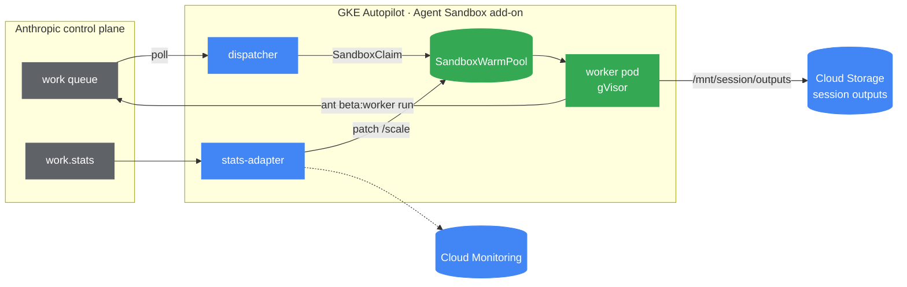
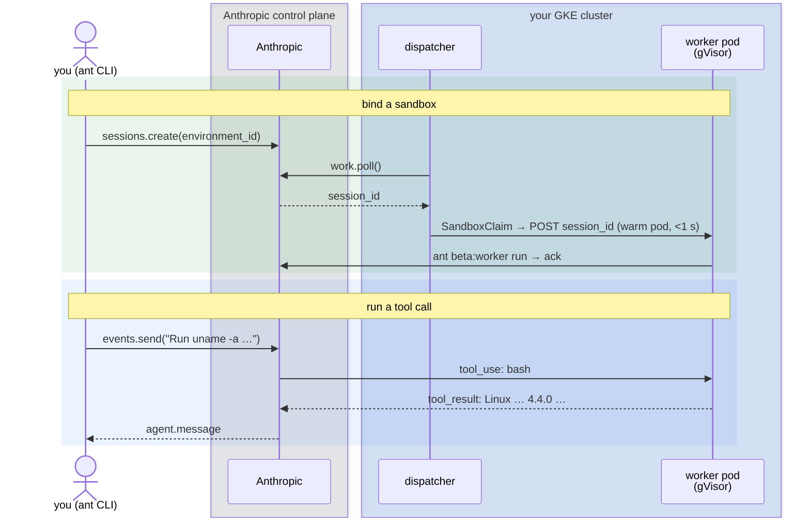

# Anthropic Managed Agents: self-hosted sandboxes on GKE Agent Sandbox

## What we are building

The
[Anthropic Managed Agents](https://docs.claude.com/en/docs/agents-and-tools/managed-agents)
feature gives Claude a `bash` shell, a filesystem, and a long-running session.
The agent loop, the model, and conversation state always stay on Anthropic's
control plane. With
[**self-hosted sandboxes**](https://docs.claude.com/en/docs/agents-and-tools/managed-agents/self-hosting),
you move only the _sandbox_ (the place where tool calls actually execute) onto
infrastructure you control: inside your VPC, behind your egress policy, under
your audit logs.

In this tutorial we deploy that sandbox infrastructure on Google Kubernetes
Engine using the
[GKE Agent Sandbox add-on](https://cloud.google.com/kubernetes-engine/docs/concepts/machine-learning/agent-sandbox).
The add-on gives us four things:

- **gVisor isolation:** each session runs in its own gVisor-isolated pod
- **Locked egress:** sandbox pods can only reach `api.anthropic.com`
- **Warm pool:** pre-created pods so the first tool call returns in seconds
- **Queue-depth scaling:** the pool grows and shrinks on Anthropic's own work-queue signal

> [!IMPORTANT]
> This is an **early-stage reference implementation**. Anthropic's self-hosted
> sandboxes and the GKE Agent Sandbox add-on are both in **Preview** and their
> APIs may
> change without notice. Use this sample to evaluate the integration and as a
> starting point for your own deployment; it is not a production-hardened
> configuration.

## Architecture

The system has three small containers (**dispatcher**, **worker**,
**stats-adapter**), each with only the credentials it needs. The diagram below
uses two Agent Sandbox custom resources: a _SandboxWarmPool_ is a set of
pre-created pods ready to accept work, and a _SandboxClaim_ is the request that
binds one of those warm pods to a single session. `ant` is the
[Anthropic CLI](https://docs.claude.com/en/docs/agents-and-tools/managed-agents/self-hosting#install-the-cli),
which we install in the prerequisites.

The first deploy (Step 3) uses only the dispatcher and worker. The
stats-adapter is added in the optional Step 5.



You have:

- **dispatcher** polls the Anthropic work queue. When a work item arrives, it
  creates a SandboxClaim to bind a warm pod to that session, then sends the
  session ID to the bound pod. Holds the Anthropic _environment key_ only.
- **worker** is a pre-warmed gVisor pod. When the dispatcher hands it a
  session, it runs `ant beta:worker run` to execute tool calls and stream
  results back to Anthropic. Holds the Anthropic _environment key_ only.
- **stats-adapter** reads `work.stats` from Anthropic every 15 seconds, writes
  the queue depth to Cloud Monitoring, and patches the SandboxWarmPool replica
  count so the pool grows and shrinks with demand. Holds the Anthropic
  _org API key_, which never reaches a sandbox pod.

Two Anthropic credentials are involved. The **environment key**
(`sk-ant-oat01-...`) can only acknowledge work and post tool results for one
environment, and it is the only credential that ever reaches a sandbox pod. The
**org API key** (`sk-ant-api03-...`) has full API access and stays outside the
sandbox entirely, used only by the stats-adapter. We create both in Step 1.

## Before you begin

You need:

- A Google Cloud project with billing enabled and
  [permissions](https://cloud.google.com/kubernetes-engine/docs/how-to/iam#roles)
  to create a GKE cluster, Artifact Registry repo, Secret Manager secrets, and
  service accounts.
- An Anthropic account with access to Managed Agents.
- These tools on your `PATH`:
  - `gcloud` >= 565.0.0 (with the `beta` component)
  - `terraform` >= 1.7
  - `kubectl` >= 1.30
  - `kustomize` >= 5.8
  - `ant` (Anthropic CLI) 1.9.1

In addition, if you do not have it yet, you need to **Install `ant`** as shown below:

```bash
ANT_VERSION=1.9.1
ARCH=$(uname -m | sed 's/x86_64/amd64/;s/aarch64/arm64/')
case "$(uname -s)" in
  Darwin)
    curl -fsSL "https://github.com/anthropics/anthropic-cli/releases/download/v${ANT_VERSION}/ant_${ANT_VERSION}_macos_${ARCH}.zip" -o /tmp/ant.zip
    sudo unzip -o /tmp/ant.zip ant -d /usr/local/bin && rm /tmp/ant.zip ;;
  Linux)
    curl -fsSL "https://github.com/anthropics/anthropic-cli/releases/download/v${ANT_VERSION}/ant_${ANT_VERSION}_linux_${ARCH}.tar.gz" \
      | sudo tar -xz -C /usr/local/bin ant ;;
esac
ant --version
```

If the download below returns a
404, check the
[Anthropic CLI releases page](https://github.com/anthropics/anthropic-cli/releases)
for the latest version and update `ANT_VERSION`.

Finally, **authenticate to Google Cloud** so Terraform and `gcloud` can create
resources in your project:

```bash
gcloud auth login
gcloud auth application-default login
gcloud config set project YOUR_PROJECT_ID
```

## Step 1: Create a self-hosted environment on Anthropic

An _environment_ is the work queue that links Anthropic's agent loop to your
cluster. Create one of type **Self-hosted**.

The easiest way is through the
[Anthropic Console](https://platform.claude.com/workspaces/default/environments):
**Environments -> New environment -> Self-hosted -> Create**.

Alternatively, create it via the API (you need your org API key for this
command only; replace the placeholder before running):

```bash
export ANTHROPIC_API_KEY=sk-ant-api03-YOUR_KEY_HERE

curl https://api.anthropic.com/v1/environments \
  -H "x-api-key: $ANTHROPIC_API_KEY" \
  -H "anthropic-version: 2023-06-01" \
  -H "anthropic-beta: managed-agents-2026-04-01" \
  -H "content-type: application/json" \
  -d '{"name":"gke-agent-sandbox","config":{"type":"self_hosted"}}'
```

Then collect two values from this step for use in Step 2:

- **Environment ID** (`env_01...`): in the Console it is in the URL of the
  environment detail page (`platform.claude.com/.../environments/env_01.../`);
  via the API it is the `id` field in the JSON response above.
- **Environment key** (`sk-ant-oat01-...`): open the environment in the
  Console and click **Generate environment key**.

The environment key is the only Anthropic credential a sandbox pod ever holds.
It can acknowledge work and post tool results, nothing else. Your org-wide
API key (`sk-ant-api03-...`) stays out of the sandbox entirely.

## Step 2: Configure your environment variables

Copy the example file:

```bash
cp .env.example .env
```

Open `.env` and fill in these four values:

- `PROJECT_ID`: your Google Cloud project ID
- `ANTHROPIC_ENVIRONMENT_ID`: the `env_...` value from Step 1
- `ANTHROPIC_ENVIRONMENT_KEY`: the `sk-ant-oat01-...` value from Step 1
- `ANTHROPIC_API_KEY`: your Anthropic org API key (`sk-ant-api03-...`) from
  Console → API Keys

The file also pre-sets `REGION` (us-central1), `CLUSTER`
(anthropic-agent-sandbox), and `SESSION_BUCKET`. You can change them, but the
defaults work for this tutorial.

Then load it. Every command below assumes these variables are in your shell:

```bash
source .env
```

**Checkpoint:** verify the variables loaded:

```bash
echo "PROJECT_ID=$PROJECT_ID  ENV_ID=$ANTHROPIC_ENVIRONMENT_ID"
```

You should see your project ID and an `env_...` string. If either is empty,
re-check `.env` and run `source .env` again.

## Step 3: Provision the infrastructure

We provision everything with three commands. The total time is about 20 minutes,
mostly spent waiting for the GKE cluster and Agent Sandbox add-on.

```bash
make infra      # ~15 min -- Autopilot cluster, Agent Sandbox add-on,
                #            Artifact Registry, Secret Manager, Workload Identity
make images     # ~1 min  -- Cloud Build builds 3 images (worker, dispatcher, stats-adapter)
make deploy     # ~10 s   -- kustomize | kubectl apply (overlay 01_single_session)
```

**`make infra`** (~15 min) runs Terraform (`terraform/`) to create a GKE
Autopilot cluster with the Agent Sandbox add-on enabled, an Artifact Registry
repo, Secret Manager secrets for both Anthropic keys, and Workload Identity
bindings for each component. Most of the 15 minutes is the Agent Sandbox
add-on initializing; it sits silent for about 11 minutes, which is expected.

**Checkpoint:** the cluster exists and you can reach it:

```bash
gcloud container clusters list --project "$PROJECT_ID" --filter "name=$CLUSTER"
```

You should see one cluster with status `RUNNING`.

With the cluster up, **`make images`** (~1 min) submits the three Dockerfiles
(`src/worker/`,
`src/dispatcher/`, `src/stats-adapter/`) to Cloud Build.

**Checkpoint:** all three images are in the registry:

```bash
gcloud artifacts docker images list \
  "${REGION}-docker.pkg.dev/${PROJECT_ID}/anthropic-agents" \
  --format="value(IMAGE)"
```

You should see three image paths: `claude-agent-worker`,
`anthropic-dispatcher`, and `anthropic-stats-adapter`.

**`make deploy`** (~10 s) applies the Kubernetes manifests from `deploy/`
using kustomize overlay `01_single_session`. This overlay runs just the
dispatcher and one warm worker pod (no stats-adapter; that is optional in
Step 5).

After `make deploy`, give Autopilot about two minutes to provision a gVisor
node for the warm pool.

**Checkpoint:** one warm pod is waiting, the dispatcher is polling:

```text
$ kubectl -n agent-sandbox get sandboxwarmpool,pods
NAME                                                              REPLICAS
sandboxwarmpool.extensions.agents.x-k8s.io/claude-agent-worker    1

NAME                              READY   STATUS    RESTARTS   AGE
pod/claude-agent-worker-xxxxx     1/1     Running   0          2m
pod/dispatcher-7c9f6d5f8b-xxxxx   1/1     Running   0          2m
```

If the worker pod stays `Pending` for more than three minutes, Autopilot is
still provisioning a gVisor node; check
`kubectl -n agent-sandbox describe pod -l app=claude-agent-worker` for a
`TriggeredScaleUp` event.

## Step 4: Pair the sandbox with a Managed Agent and verify

The sandbox is deployed; now we connect a Managed Agent to it and confirm tool
calls land on our cluster. The flow when a session starts:



Authenticate the `ant` CLI (one-time). After login, unset `ANTHROPIC_API_KEY`
so it does not shadow the OAuth token for interactive commands:

```bash
source .env
ant auth login
unset ANTHROPIC_API_KEY
```

With the CLI authenticated, create an agent and open a session bound to your
self-hosted environment:

```bash
AGENT_ID=$(ant beta:agents create \
  --name gke-sandbox-probe \
  --model '{"id":"claude-sonnet-4-6"}' \
  --system 'You run tools inside a self-hosted sandbox on GKE under gVisor. Use bash to inspect the environment when asked.' \
  --tool '{"type":"agent_toolset_20260401"}' \
  --format json --transform 'id' -r)

SESSION_ID=$(ant beta:sessions create \
  --agent '{"id":"'"$AGENT_ID"'","type":"agent"}' \
  --environment-id "$ANTHROPIC_ENVIRONMENT_ID" \
  --format json --transform 'id' -r)
echo "AGENT_ID=$AGENT_ID  SESSION_ID=$SESSION_ID"
```

Then send one prompt that asks the agent to identify its runtime, wait about
15 seconds, and read the answer:

```bash
ant beta:sessions:events send --session-id "$SESSION_ID" \
  --event '{"type":"user.message","content":[{"type":"text","text":"Run `uname -a && hostname` and tell me what sandbox you are executing in."}]}'

sleep 15

ant beta:sessions:events list --session-id "$SESSION_ID" --order asc --format jsonl \
  | jq -r 'select(.type=="agent.message") | .content[0].text'
```

**Checkpoint:** the model reports the gVisor kernel and your pod's hostname:

```text
Kernel: Linux 4.4.0 -- characteristic of gVisor, which presents a synthetic
kernel to the container ... Hostname: claude-agent-worker-2tjdz ... consistent
with a Google Kubernetes Engine deployment.
```

The `4.4.0` kernel string is gVisor's signature: the `bash` ran on a pod in
your cluster, not on Anthropic's infrastructure. To confirm from the cluster
side, the same `uname` output is in your worker pod's log:

```bash
kubectl -n agent-sandbox logs -l app=claude-agent-worker --tail=20 --prefix
```

Anything the agent writes to `/mnt/session/outputs` inside the sandbox lands in
a Cloud Storage bucket via the
[GCS FUSE CSI driver](https://cloud.google.com/kubernetes-engine/docs/how-to/persistent-volumes/cloud-storage-fuse-csi-driver),
under a per-session prefix:

```bash
gcloud storage ls -r "gs://${SESSION_BUCKET}/${SESSION_ID}/"
```

The worker's service account has `roles/storage.objectUser` on this one bucket
only. For stricter isolation, use one bucket per trust boundary or IAM
Conditions on the object prefix.

The sandbox is now paired with your Anthropic environment. Any agent or session
you create with `--environment-id "$ANTHROPIC_ENVIRONMENT_ID"` will execute its
tool calls here.

> [!NOTE]
> The `--model` and `--agent` flags accept a string per `--help`, but `ant`
> 1.9.1 only parses the JSON object form, so pass `'{"id":"..."}'`. Prefer
> `events list` over `events stream` for inspection; `stream` only emits
> events that arrive _after_ it connects.

## (Optional) Step 5: Enable autoscaling on queue depth

Overlay `01_single_session` runs one warm pod and no autoscaler. For real
traffic, switch to overlay `02_warmpool_autoscale`, which adds the
**stats-adapter**: it reads Anthropic's `work.stats` endpoint every 15 seconds
and patches the warm pool's replica count to match the number of concurrent
sessions.

```bash
make deploy OVERLAY=02_warmpool_autoscale
```

**Checkpoint:** the stats-adapter pod is `Running` and the warm pool sits at
its minimum of 2 replicas:

```text
$ kubectl -n agent-sandbox get deploy/stats-adapter sandboxwarmpool/claude-agent-worker
NAME                            READY   UP-TO-DATE   AVAILABLE   AGE
deployment.apps/stats-adapter   1/1     1            1           30s

NAME                                                             AGE
sandboxwarmpool.extensions.agents.x-k8s.io/claude-agent-worker   ...
```

To see the autoscaler in action, create several sessions against your
environment ID and watch `kubectl get sandboxwarmpool claude-agent-worker -w`:
`REPLICAS` steps up to match within one or two 15-second ticks, then drains
back to 2 once the sessions are deleted.

The `SandboxWarmPool` exposes a `/scale` subresource, so a Kubernetes
`HorizontalPodAutoscaler` can drive it instead of the stats-adapter; see
[`deploy/overlays/02_warmpool_autoscale/scale.yaml`](deploy/overlays/02_warmpool_autoscale/scale.yaml)
for the RBAC the direct-patch path uses and the trade-off against an HPA.

## Clean up

```bash
ant beta:sessions list --format jsonl | jq -r '.id' \
  | xargs -I{} ant beta:sessions delete --session-id {}
kubectl -n agent-sandbox delete sandboxclaim --all
make destroy
```

## What's next

The sandbox is running and paired. From here, make it useful for your own
agents:

- Point the `FQDNNetworkPolicy` at your own internal services so the agent can
  call them. That is the whole point of self-hosting.
- Swap the worker image for one with your own tools pre-installed
  (`src/worker/Dockerfile`).

## Learn more

- [GKE Agent Sandbox concepts](https://cloud.google.com/kubernetes-engine/docs/concepts/machine-learning/agent-sandbox)
- [GKE FQDN Network Policy](https://cloud.google.com/kubernetes-engine/docs/how-to/fqdn-network-policies)
- [Anthropic Managed Agents: self-hosting](https://docs.claude.com/en/docs/agents-and-tools/managed-agents/self-hosting)
- [kubernetes-sigs/agent-sandbox](https://github.com/kubernetes-sigs/agent-sandbox) (upstream Kubernetes SIG project)
