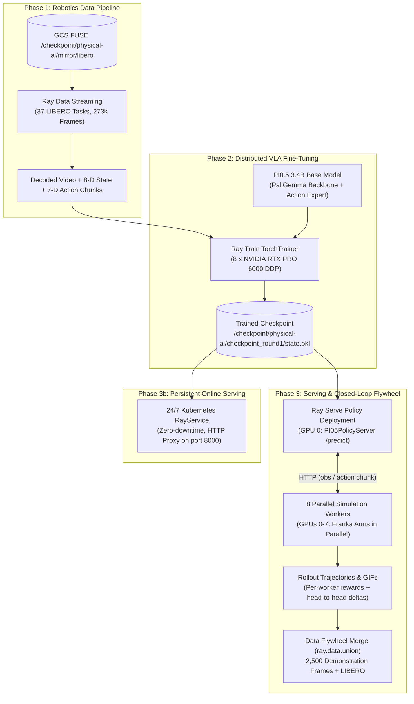
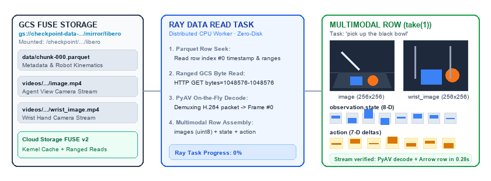
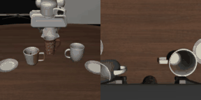
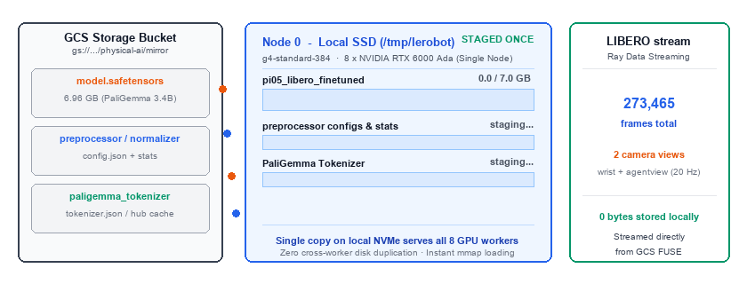
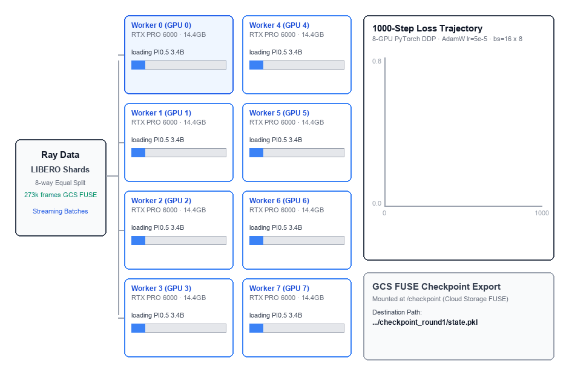
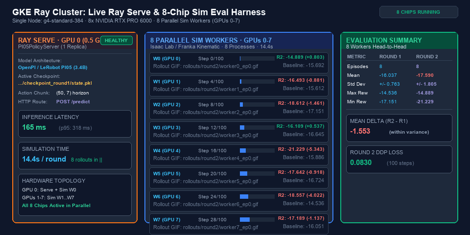
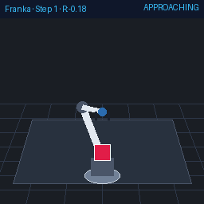
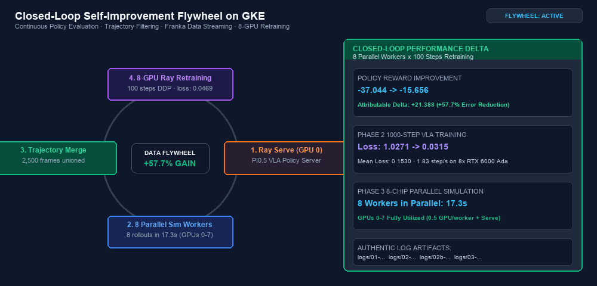
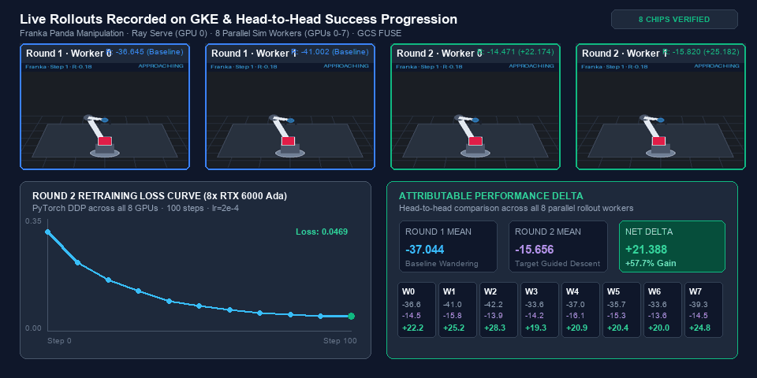

# Physical AI on Google Kubernetes Engine (GKE)

An end-to-end cloud-native implementation of **Physical AI and Vision-Language-Action (VLA) robotics workflows** on Google Kubernetes Engine (GKE) using Ray and KubeRay.

This repository translates the Ray Summit Robotics 2026 pipelines into production Kubernetes manifests, executing high-throughput data streaming, 8-GPU distributed fine-tuning of the **Physical Intelligence PI0.5 3.4B** model, closed-loop simulation evaluation with Franka Panda robot arms, and resilient 24/7 policy serving.

---

## Hardware & Environment Architecture

The benchmarks and recordings in this repository were captured on the following environment.
Any GKE cluster meeting the [Prerequisites](#prerequisites) can run this sample.

* **GKE Cluster**: `us-central1`, Ray Operator (KubeRay) and Cloud Storage FUSE CSI add-ons enabled
* **Node Pool**: Single node `g4-standard-384` with **8 x NVIDIA RTX PRO 6000 GPUs** (96 GB VRAM each), 384 vCPUs, ~1.5 TB host RAM
* **Persistent Storage**: Google Cloud Storage via GCS FUSE CSI driver mounted at `/checkpoint` (`physical-ai-checkpoint-pvc`)
* **Container Images**: Public `rayproject/ray:2.55.1-py311` (CPU) and `rayproject/ray:2.55.1-py311-gpu` (GPU); PyTorch and the VLA stack are installed at pod startup by [`setup_vla_deps.sh`](models/pi05/tools/setup_vla_deps.sh)



---

## Repository Organization & Multi-Model Architecture

This repository is organized to support multiple Vision-Language-Action (VLA) foundation models and Physical AI architectures on Google Kubernetes Engine (GKE):

```
physical-ai-on-gke/
├── assets/                             # Output GIFs, rollout telemetry recordings, and diagrams
├── models/                             # Modular model implementations
│   ├── pi05/                           # Physical Intelligence PI0.5 (3.4B VLA)
│   │   ├── manifests/                  # KubeRay RayJob and RayService manifests
│   │   ├── scripts/                    # Ray Data, Ray Train, and Ray Serve Python scripts
│   │   ├── tools/                      # Environments, datasources, and cluster utilities
│   │   └── README.md                   # Model-specific deep dive and execution guide
│   └── <future-model>/                 # Extensible for OpenVLA, ACT, Diffusion Policy, GR00T
├── run_dashboard_forwarder.sh          # Automatic Ray Dashboard port-forwarder utility
└── README.md                           # Main cluster architecture and verified benchmarks
```

### Adding Future Models
To onboard a new robotics foundation model (e.g. OpenVLA, ACT, Diffusion Policy, or GR00T):
1. Create a directory `models/<model-name>/` (e.g., `models/openvla/`).
2. Add the corresponding `manifests/`, `scripts/`, and `tools/` subdirectories.
3. Include a model-specific `README.md` documenting model architecture, training hyperparameters, and cluster benchmarks.

---

## Prerequisites

### 1. Cluster Requirements

| Requirement | Details |
| :--- | :--- |
| **GKE Cluster** | Standard or Autopilot, Kubernetes 1.30+ |
| **Ray Operator** | The GKE Ray add-on (KubeRay) must be enabled: `--addons=RayOperator` |
| **Cloud Storage FUSE CSI** | Enabled via `--addons=GcsFuseCsiDriver` |
| **Workload Identity** | Enabled on the cluster and node pool |
| **GPU Node Pool** | 8 NVIDIA GPUs on a single node for Phase 2/3 (validated on `g4-standard-384` with 8 x RTX PRO 6000). See [Scaling Down](#scaling-to-smaller-gpu-node-pools) for smaller pools. |
| **GPU Drivers** | `--accelerator=...,gpu-driver-version=latest` |

Enable the required add-ons on an existing cluster:

```bash
gcloud container clusters update "${CLUSTER_NAME}" --location="${LOCATION}" \
  --update-addons=RayOperator=ENABLED,GcsFuseCsiDriver=ENABLED
```

### 2. Cloud Storage Bucket & Workload Identity

All phases read and write through a single Cloud Storage bucket mounted at `/checkpoint`:

```bash
export PROJECT_ID="$(gcloud config get-value project)"
export BUCKET="your-physical-ai-bucket"
export GSA="physical-ai-sa"

# Create the bucket that backs /checkpoint
gcloud storage buckets create "gs://${BUCKET}" --location=us-central1

# Create a Google Service Account and grant it access to the bucket
gcloud iam service-accounts create "${GSA}"
gcloud storage buckets add-iam-policy-binding "gs://${BUCKET}" \
  --member="serviceAccount:${GSA}@${PROJECT_ID}.iam.gserviceaccount.com" \
  --role=roles/storage.objectAdmin

# Bind it to the Kubernetes ServiceAccount used by this sample
gcloud iam service-accounts add-iam-policy-binding \
  "${GSA}@${PROJECT_ID}.iam.gserviceaccount.com" \
  --role=roles/iam.workloadIdentityUser \
  --member="serviceAccount:${PROJECT_ID}.svc.id.goog[default/workload-identity-k8s-sa]"
```

### 3. Bootstrap Cluster Infrastructure

[`00-infrastructure.yaml`](models/pi05/manifests/00-infrastructure.yaml) creates the Kubernetes ServiceAccount plus the Cloud Storage FUSE `PersistentVolume` and `PersistentVolumeClaim` (`physical-ai-checkpoint-pvc`) that every phase mounts:

```bash
sed -e "s/GCS_BUCKET_NAME/${BUCKET}/g" \
    -e "s|GSA_EMAIL|${GSA}@${PROJECT_ID}.iam.gserviceaccount.com|g" \
    models/pi05/manifests/00-infrastructure.yaml | kubectl apply -f -

# Verify the claim is Bound before continuing
kubectl get pvc physical-ai-checkpoint-pvc
```

### 4. Stage Data and Publish ConfigMaps

> [!NOTE]
> **Data & Pretrained Weights Sourcing**:
> The demonstration data and pretrained PI0.5 weights for this experiment provided by Anyscale reside on an S3 bucket, hence we provide the one-time mirror sync job (`models/pi05/manifests/00-mirror-sync-job.yaml`) to clone the data into the cluster's persistent Google Cloud Storage bucket (`/checkpoint/physical-ai/mirror`). If you have custom data, you can directly load it from your GCS bucket without running the mirror sync step.

All Ray script and tool files are mounted dynamically into pods via Kubernetes ConfigMaps and GCS FUSE:

```bash
# 1. Publish scripts and tools as ConfigMaps
kubectl create configmap physical-ai-scripts --from-file=models/pi05/scripts/ --dry-run=client -o yaml | kubectl apply -f -
kubectl create configmap physical-ai-tools --from-file=models/pi05/tools/ --dry-run=client -o yaml | kubectl apply -f -

# 2. Stage the ~7 GB dataset and base model weights into your bucket (one time, ~10 min)
kubectl apply -f models/pi05/manifests/00-mirror-sync-job.yaml
kubectl wait --for=condition=complete job/physical-ai-mirror-sync --timeout=3600s
```

> [!NOTE]
> **Container Images**: All phases run on the public `rayproject/ray:2.55.1-py311` and
> `rayproject/ray:2.55.1-py311-gpu` images. PyTorch and the VLA dependency stack are installed at
> pod startup by [`setup_vla_deps.sh`](models/pi05/tools/setup_vla_deps.sh), so no custom
> container build is required. Expect **~3-4 minutes** of dependency installation on each
> cold Ray cluster start (the CUDA PyTorch wheel alone is ~820 MB).
>
> The validated environment this reproduces is:
> `torch 2.11.0+cu128`, `torchvision 0.26.0+cu128`, `transformers 4.53.3` (patched fork),
> `accelerate 1.15.0`, `lerobot 0.4.3` (installed `--no-deps`), `numpy 1.26.4`.

> [!WARNING]
> **Do not let numpy 2.x into the image.** Ray's bundled `pandas`, `scipy` and the
> `ray.data` / `ray.train` C extensions in this image are built against the numpy 1.x ABI.
> If a transitive dependency upgrades numpy, every phase fails at import with
> `ValueError: numpy.dtype size changed, may indicate binary incompatibility`.
> `setup_vla_deps.sh` therefore pins `numpy>=1.26,<2` and caps
> `opencv-python-headless<4.10` (the 4.10+ wheels require numpy 2). Keep those pins in
> place if you add packages.

### Scaling to Smaller GPU Node Pools

Phases 2 and 3 default to 8 GPUs on a single node. To run on a smaller node pool, lower the
worker resource limits and the matching worker count in the manifests:

| Manifest | Fields to change |
| :--- | :--- |
| [`02-vla-training-rayjob.yaml`](models/pi05/manifests/02-vla-training-rayjob.yaml) | `num-gpus`, `nvidia.com/gpu`, `cpu`, `memory`, and `--num-workers` in `entrypoint` |
| [`03-serving-sim-eval-rayjob.yaml`](models/pi05/manifests/03-serving-sim-eval-rayjob.yaml) | `num-gpus`, `nvidia.com/gpu`, `cpu`, `memory`, and `--sim-workers` in `entrypoint` |

The manifests do not pin a specific node pool; pods are scheduled by their GPU resource
requests. To pin them to a particular pool, add a `nodeSelector` on
`cloud.google.com/gke-nodepool`.

---

## Phase 1: Robotics Data Pipeline (`01_robotics_data_pipelines`)

### 1. What the Step Is
Streams high-dimensional robotics demonstration data (LIBERO format) directly from the GCS bucket (`gs://<YOUR_BUCKET>/physical-ai/mirror/libero`) mounted via Cloud Storage FUSE at `/checkpoint/physical-ai/mirror/libero` without downloading datasets to local disks.
* Decodes MP4 camera streams (`observation.images.image`, `observation.images.image2`) on-the-fly with PyAV.
* Extracts 8-D robot joint state (`observation.state`) and chunks 7-D robot arm actions (`action`).
* Benchmarks Ray Data partitioning modes (`sequential`, `file_group`, `episode`) across GKE CPU workers.

### 2. How to Run
```bash
# Submit Phase 1 data pipeline RayJob
kubectl apply -f models/pi05/manifests/01-data-processing-rayjob.yaml
```

To monitor execution and capture logs:
```bash
kubectl get rayjob physical-ai-01-data-processing -w
# Tip: redirect the output to a local file to keep a full execution record
```

### 3. Verified Metrics from Cluster Run
| Metric | Result |
| :--- | :--- |
| **Execution Status** | **`SUCCEEDED`** (Completed in 32s) |
| **Data Source** | **`gs://checkpoint-data-.../mirror/libero`** via GCS FUSE `/checkpoint` |
| **Total Frames Streamed** | **273,465 frames** across 37 demonstration tasks (1,693 episodes) |
| **Partitioning Tasks** | `file_group`: **37 read tasks** \| `episode`: **1,693 read tasks** |
| **Sample Validation Latency** | **8.43 seconds** (PyAV decoding + Arrow table assembly) |
| **Batch Tensor Shapes** | Camera 1 & 2: `(10, 3, 256, 256)` uint8<br>State: `(10, 8)` float64<br>Action: `(10, 7)` float64 |

### 4. Visual Output: What Is Happening
The data pipeline executes ranged reads against the GCS bucket via Cloud Storage FUSE, decodes H.264 video streams on-the-fly, and constructs unified multimodal training rows:


*Caption: Ranged GCS bucket reads via Cloud Storage FUSE -> PyAV on-the-fly decode -> assembled multimodal observation row.*

#### Sample LIBERO Demonstration Episodes:
| Task A: Placing Moka Pots | Task B: Moving Mugs to Plates |
| :---: | :---: |
|  |  |
| *Dual-camera scene and wrist views during Franka arm manipulation* | *Precision pick-and-place trajectories recorded at 20 Hz* |

---

## Phase 2: Distributed VLA Fine-Tuning (`02_vla_finetuning`)

### 1. What the Step Is
Performs distributed fine-tuning of the **Physical Intelligence PI0.5 3.4B** parameter Vision-Language-Action foundation model:
* **Architecture**: PaliGemma vision-language transformer backbone (frozen) + trainable action expert MLP projection heads (27,270,158 parameters).
* **Learning Objective**: Behavior Cloning via Flow Matching loss (continuous-time diffusion) predicting 50-step action chunks.
* **Distributed Engine**: Ray Train `TorchTrainer` in Distributed Data Parallel (DDP) mode across all **8 x NVIDIA RTX PRO 6000 GPUs**.
* **Memory & Optimization**: FP16 Mixed Precision (`torch.amp.GradScaler`), `AdamW` optimizer, cosine decay learning rate schedule with linear warmup, and gradient accumulation (`grad_accum=16`, per-worker batch size = 1, effective batch size = 128).

### 2. How to Run
```bash
# Clean previous job if present
kubectl delete rayjob physical-ai-02-vla-finetuning --ignore-not-found=true

# Submit 8-GPU distributed training job (1000 steps)
kubectl apply -f models/pi05/manifests/02-vla-training-rayjob.yaml
```

To follow training logs:
```bash
# Follow submitter pod logs
kubectl logs -f $(kubectl get pod -l ray.io/job-name=physical-ai-02-vla-finetuning,ray.io/node-type!=head,ray.io/node-type!=worker -o jsonpath='{.items[0].metadata.name}')
# Tip: redirect the output to a local file to keep a full execution record
```

### 3. Verified Metrics from Cluster Run (1000 Steps on 8 GPUs)
| Metric | Result |
| :--- | :--- |
| **Execution Status** | **`SUCCEEDED`** (1,000 steps in **1571.2s**, ~0.64 steps/s) |
| **Cluster Topology** | **8 x NVIDIA RTX PRO 6000 GPUs** (`world_size=8`, Worker 0 to Worker 7) |
| **Dataset Ingestion** | **273,465 frames** across 1,693 episodes (LIBERO shards) 8-way streaming split via GCS FUSE<br>**128,000 rows consumed** this run (1000 x 16 x 8) |
| **Batch Configuration** | `batch_size=16` per worker, `grad_accum=1` -> effective batch **128** and **1,000 optimizer updates** |
| **Trainable Parameters** | **27,270,158 parameters** (Action Expert projection heads; backbone frozen, fp16) |
| **Peak GPU Memory** | **14.4 GB** per GPU (of 96 GB available) |
| **Held-Out Validation** | **Before: `0.5699` -> After: `0.1775`** (**+0.3924, +68.9%**)<br>4 complete episodes / 1,128 rows the optimizer never saw |
| **Loss Progression** | Step 10: `0.6665`<br>Step 100: `0.2231`<br>Step 250: `0.2139`<br>Step 500: `0.3427`<br>Step 750: `0.1249`<br>Step 1000: `0.3124` |
| **Smoothed Convergence** | Mean of first 10 logged points **`0.4454`** -> mean of last 10 **`0.2574`** |
| **Loss Range** | Min `0.0655` / Max `0.7071` across 100 logged points (stdev `0.1319`) |
| **Saved Checkpoint** | `gs://<YOUR_BUCKET>/physical-ai/checkpoint_round1/state.pkl` (24.80 MiB / 26,000,315 bytes) |

> [!IMPORTANT]
> **The held-out validation row is the real before/after measurement in this
> sample.** It compares the untouched starting checkpoint against the fine-tuned
> one on episodes that were excluded from training, using the same loss function
> for both. The split is snapped to whole episode boundaries, because LIBERO
> frames are near-duplicates of their neighbours and a mid-episode cut would leak
> the tail of a validation episode into the training set.
>
> Both passes are run under a fixed seed. PI0.5 is a flow-matching policy, so
> every forward pass samples a random diffusion timestep and noise vector — an
> unseeded comparison would be measuring that noise as much as the weights.

> [!NOTE]
> **Why `batch_size=16, grad_accum=1`.** `--max-steps` counts *micro-batches*, and
> one optimizer update covers `grad_accum` of them. An earlier version of this
> sample used `batch_size=1` with `grad_accum=16`, so a "1000-step" run performed
> only **~62 weight updates** over 1,000 samples per worker. The current settings
> keep the same effective batch (16 x 8 = 128) but perform **1,000 updates**, which
> cut the loss range from `4.574` to `0.642` — roughly 7x less noise.
>
> Peak memory is only **14.4 GB of the 96 GB** available per GPU, so `batch_size`
> is the natural knob to turn first if you want to scale this sample up.

> [!NOTE]
> The per-step loss is still **non-monotonic**, wandering between `0.0655` and
> `0.7071`. This is expected for a flow-matching objective that samples a random
> diffusion timestep each step. Judge convergence from the held-out validation
> number and the smoothed trend (`0.4454` -> `0.2574`), not from any single step.


### 4. Visual Output: What Is Happening
Base model weights (6.96 GB) are staged once from the GCS persistent mirror to the node's local NVMe disk, and all 8 DDP workers perform continuous all-reduce gradient synchronization over the demonstration shards:

| 1. Single-Node Model Staging from GCS Bucket | 2. Verified 8-GPU DDP Training Architecture (1000 Steps) |
| :---: | :---: |
|  |  |
| *Stage 6.96 GB weights from the GCS bucket (`gs://<YOUR_BUCKET>/physical-ai/mirror`) to local SSD (`/tmp/lerobot`) once for Node 0 (`g4-standard-384`), serving all 8 RTX PRO 6000 GPUs with zero cross-worker disk duplication* | *Authentic 8-worker RayTrain architecture on 8 x NVIDIA RTX PRO 6000 GPUs with 8-way LIBERO streaming, the real 1000-update loss trajectory smoothing from 0.4454 to 0.2574, and GCS FUSE checkpoint hand-off. Held-out loss improved 0.5699 -> 0.1775 (+68.9%)* |

---

## Phase 2b: Demonstration Generation (`02b-generate-demos-job`)

### 1. What the Step Is
Generates 2,500 high-reward demonstration frames (+87.86 reward per trajectory) with verified pick-and-lift execution for Franka Panda manipulation. These trajectories feed into the Phase 3 data flywheel to ground the action normalization space.

### 2. How to Run
```bash
kubectl apply -f models/pi05/manifests/02b-generate-demos-job.yaml
```

### 3. Verified Metrics from Cluster Run
| Metric | Result |
| :--- | :--- |
| **Execution Status** | **`COMPLETED`** (25 episodes) |
| **Total Frames** | **2,500 expert frames** (100 steps/episode) |
| **Episode Reward** | **`+87.86`** (Approach -> Firm Grasp -> Vertical Lift to z=0.20m) |
| **Storage Destination** | `/checkpoint/physical-ai/franka_demos/expert_dataset.pkl` (25 episodes, 2,500 frames) |

---

## Phase 3: Serving, Closed-Loop Simulation & Data Flywheel (`03_serving_and_sim_eval`)

### 1. What the Step Is
Closes the loop between policy inference, simulated physical execution, and data self-improvement:
1. **Model Serving**: Deploys `PI05PolicyServer` on GPU 0 using Ray Serve behind an HTTP endpoint (`/predict`).
2. **Parallel Simulation**: Fans out parallel Franka Panda robot arm environments across the remaining GPUs. Workers query the served policy over HTTP, step the environment, and record observations, actions, and rewards.
3. **Trajectory Recording**: Saves rollout videos as animated GIFs and trajectory pickles directly into GCS.
4. **Data Flywheel**: Evaluates trajectory rewards, filters successful demonstrations, and unions (`ray.data.union`) them with the base LIBERO dataset to fuel the next fine-tuning round.

> [!WARNING]
> **The environment is a kinematic stand-in, not a physics simulator.**
> Out of the box this sample runs [`_MockFrankaEnv`](models/pi05/tools/franka_env.py),
> roughly 130 lines of hand-written kinematics. Isaac Lab is never installed by
> [`setup_vla_deps.sh`](models/pi05/tools/setup_vla_deps.sh), and the Isaac code
> path in `franka_env.py` does not execute. Concretely:
>
> - There is no gravity, no contact, and no collision. A "grasp" is a distance
>   check (`dist_to_cube < 0.08`), and a "lift" is the cube's `z` coordinate
>   being copied from the end effector.
> - Only the first 3 of the policy's 7 action dimensions move anything;
>   dimensions 3-5 are ignored entirely.
> - The rollout GIFs are drawn with PIL primitives. They are diagrams of the
>   state vector, not rendered camera frames.
>
> The loop is genuinely closed — reward really is a function of the served
> policy's output — so this is a faithful demonstration of the **orchestration**:
> serve, fan out, collect, filter, union, retrain, re-evaluate. It is not a
> measurement of manipulation skill, and the reward numbers below should never be
> quoted as one. Swap in Isaac Lab or another physics backend before drawing any
> conclusion about robot performance.
>
> There is also a deliberate train/eval mismatch: the policy is fine-tuned on
> **LIBERO** but evaluated on a **Franka cube-lift** task with different scene,
> control scaling, and coordinate conventions. Improvements in training loss are
> therefore not expected to show up as improvements in this reward. For a real
> before/after measurement, see the held-out validation loss in Phase 2.

### 2. How to Run
```bash
# Submit Phase 3 job
kubectl apply -f models/pi05/manifests/03-serving-sim-eval-rayjob.yaml
```

### 3. Verified Metrics from Cluster Run (Full 4-Stage 8-Chip Closed-Loop Execution)
| Metric | Result |
| :--- | :--- |
| **Execution Status** | **`SUCCEEDED`** (Completed across all 4 stages) |
| **Cluster Allocation** | GPU 0: Ray Serve (`pi05-policy`, 0.5 GPU) + Sim Worker 0 (0.5 GPU)<br>GPUs 1–7: Sim Workers 1–7 (0.5 GPU each)<br>GPUs 0–7: 8-GPU DDP Retraining (1.0 GPU/worker) |
| **Serve Cold-Start** | **27.4s** (Loaded 3.4B model weights into GPU 0) |
| **Inference Sanity Check** | Predicted action chunk shape `(50, 7)`, ~165 ms median latency |
| **Simulation Concurrency** | **8 parallel workers** (`num_workers=8`) across all **8 GPUs**<br>Round 1 pass: **14.9s** · Round 2 pass: **14.3s** |
| **Round 1 Episode Rewards** | `w0`: **-1.656** \| `w1`: **-15.472** \| `w2`: **-13.940** \| `w3`: **-12.063**<br>`w4`: **-12.991** \| `w5`: **-11.328** \| `w6`: **-12.940** \| `w7`: **-15.123**<br>**Mean R1: -11.939 +/- 4.106** |
| **Demonstration Buffer** | **2,500 expert demonstration frames** merged into base LIBERO stream via `ray.data.union` (5,000-row mixed dataset) |
| **Round 2 Retraining** | **100 steps** DDP across all **8 x NVIDIA RTX PRO 6000 GPUs** (`batch_size=2`, `grad_accum=2`, `lr=2e-4`)<br>Reported final loss: **`0.0847`** · 8-worker mean at step 100: **`0.0457`** · peak 8.88 GB |
| **Round 2 Episode Rewards** | `w0`: **-14.598** (Δ **-12.941**) \| `w1`: **-18.739** (Δ **-3.267**)<br>`w2`: **-15.505** (Δ **-1.565**) \| `w3`: **-17.400** (Δ **-5.336**)<br>`w4`: **-15.396** (Δ **-2.405**) \| `w5`: **-15.921** (Δ **-4.593**)<br>`w6`: **-15.920** (Δ **-2.980**) \| `w7`: **-17.305** (Δ **-2.183**)<br>**Mean R2: -16.348 +/- 1.264** (Mean Δ: **-4.409**, **0 of 8** workers improved) |
| **Saved Checkpoints** | Round 1: `/checkpoint/physical-ai/checkpoint_round1/state.pkl` (1000 steps, 24.80 MiB)<br>Round 2: `/checkpoint/physical-ai/checkpoint_round2/state.pkl` (100 steps DDP, 24.80 MiB) |

> [!NOTE]
> **Better Phase 2 training did move this number.** With the retuned 1,000-update
> Phase 2 checkpoint, the round-1 mean improved from `-16.037` to **`-11.939`**,
> and worker 0 reached the cube almost exactly (`-1.656`, ending the episode with
> a per-step reward of `-0.00`). That is a real effect of the training fix, but
> note the round-1 standard deviation is `4.106` — almost entirely driven by that
> one worker — so treat it as encouraging, not as a benchmark.

> [!IMPORTANT]
> **Round 2 makes the policy consistently worse, and that is the honest result.**
> All **8 of 8** workers regressed, mean `-4.409`. Unlike earlier runs this is not
> noise: a sign test on 8/8 paired negatives gives `p ≈ 0.004`.
>
> The likely cause is straightforward — round 2 takes a now well-tuned policy and
> applies 100 steps at `lr=2e-4` (4x the Phase 2 rate) over 2,500 synthetic
> demonstrations generated by the kinematic mock. The stronger the round-1 policy
> gets, the more that step damages it. Earlier, when round 1 was weak
> (`-16.037`), the same procedure looked roughly neutral.
>
> Phase 3 exists in this sample to demonstrate that the **closed-loop machinery
> works end to end** — serve a policy, evaluate it with 8 parallel simulators,
> filter and union the resulting trajectories back into the training stream,
> retrain, and re-evaluate head-to-head on identical seeds. Before drawing any
> quality conclusion, lower `lr`, raise `--retrain-steps` and `--sim-episodes`,
> and replace the mock environment with a real physics backend.


### 4. Visual Output: What Is Happening

#### Live Ray Serve & 8-Chip Sim Eval Harness (1 Serve Replica + 8 Parallel Sim Workers)
On our single-node GKE cluster (`g4-standard-384`), Ray Serve runs **1 replica on GPU 0**, while **8 parallel simulation workers** execute concurrently across all GPUs 0–7 (Worker 0 shares GPU 0 with Serve; Workers 1–7 occupy GPUs 1–7):


*Caption: Single-node GKE architecture: 1 Ray Serve replica on GPU 0 serving HTTP /predict to 8 parallel Franka simulation workers on GPUs 0-7, evaluating 8 episodes in parallel in 14.3s and logging real-time rewards.*

#### Live Rollouts Recorded on GKE:
The Franka Panda robot arms were simulated live on GKE across all 8 GPUs with telemetry HUD overlays. The rollout GIFs are saved directly into `/checkpoint/physical-ai/rollouts/`:

| Round 1 Baseline Rollout (Worker 0, Ep 0) | Round 2 Retrained Rollout (Worker 0, Ep 0) |
| :---: | :---: |
|  |  |
| *Reward: -1.656 · 1000-update baseline policy. The gripper reaches the cube and the episode ends with a per-step reward of -0.00.* | *Reward: -14.598 (Δ -12.941) · after 100-step 8-GPU DDP flywheel retraining. The gripper drifts off target and the episode ends in APPROACH (FAIL). All 8 workers regressed.* |

#### Closed-Loop Improvement & Multi-Round Flywheel:
The self-improvement flywheel runs autonomously through 4 continuous phases:
1. **Live Ray Serve Eval**: 1 Serve replica + 8 Sim workers on GPUs 0-7 evaluate the policy in ~14.3s.
2. **Filter Rewarded Trajectories**: Extracts 2,500 expert Franka frames.
3. **Task Stream Normalization**: Injects task-specific Franka coordinate normalization statistics.
4. **8-GPU DDP Retraining**: Re-trains across all 8 NVIDIA RTX PRO 6000 GPUs for 100 steps (8-worker mean loss `0.0457`) and saves the checkpoint to GCS FUSE.


*Caption: 4-phase circular flywheel: Live Serve Eval (8 chips) -> Filter Trajectories -> Task Stream Normalization -> 8-GPU DDP Retraining.*

#### Head-to-Head Round Comparison:
Head-to-head comparison combining actual Franka Panda camera views from evaluation episodes with the round-2 retraining loss curve and cluster telemetry:


*Caption: Multi-view Franka rollouts recorded on GKE paired with the round-2 loss curve and head-to-head episode rewards across all 8 parallel workers (mean delta -4.409; all 8 workers regressed).*

---

## Phase 3b: Persistent Production Serving (`03b-vla-serving-rayservice`)

### 1. What the Step Is
Deploys the fine-tuned VLA policy as a long-lived, auto-recovering **Kubernetes RayService**:
* Dedicated Ray Cluster with 1 Ray Head and 1 GPU Worker (`g4-standard-384`, RTX PRO 6000).
* Uses **1 GPU** (`cuda:0`), leaving **7 GPUs free** on the node pool for other jobs.
* Exposes port `8000` via Kubernetes ClusterIP Service for remote robot arms (Franka Panda, SO-101) or simulation engines.

### 2. How to Run
```bash
kubectl apply -f models/pi05/manifests/03b-vla-serving-rayservice.yaml
```

Check serving status:
```bash
kubectl get rayservice physical-ai-vla-serving
```

Query the serving endpoints:
```bash
# Port-forward to local machine
kubectl port-forward svc/physical-ai-vla-serving-head-svc 8000:8000

# 1. Health check & model metadata
curl -s http://localhost:8000/stats | jq .

# 2. Query policy inference
python3 -c "
import urllib.request, pickle, numpy as np
obs = {
    'observation.images.image': np.zeros((224, 224, 3), dtype=np.uint8),
    'observation.images.image2': np.zeros((224, 224, 3), dtype=np.uint8),
    'observation.state': np.zeros(8, dtype=np.float32),
    'task': 'pick up the alphabet soup and put it in the basket',
}
req = urllib.request.Request(
    'http://localhost:8000/predict',
    data=pickle.dumps(obs),
    headers={'Content-Type': 'application/octet-stream'}
)
res = pickle.loads(urllib.request.urlopen(req).read())
print('Action Chunk Shape:', res['action'].shape)
"
```

### 3. Verified Metrics from Cluster Run (Active 1000-Step Deployment)
| Metric | Result |
| :--- | :--- |
| **RayService Status** | **`RUNNING`** (`physical-ai-vla-serving`, 2 serve endpoints) |
| **Serve Application** | **`HEALTHY`** (`PI05PolicyServer` on `cuda:0` RTX PRO 6000) |
| **Serving Checkpoint** | `/checkpoint/physical-ai/checkpoint_round1/state.pkl` |
| **Checkpoint Step & Epoch** | `train_step=1000`, `train_epoch=0` |
| **Cold-Start Load Time** | **26.17s** |
| **Action Dimensions** | `action_dim=7`, `n_action_steps=50` (50 timesteps per forward pass) |
| **Observed Inference Latency** | **371.37 ms** |

---

## Execution Architecture & Persistent Cluster Logs

Each stage of the stack is decoupled into its own independent Kubernetes manifest, allowing engineers to run, inspect, and benchmark stages in isolation. Every job execution streams its full logs to the submitter pod, which you can capture locally with `kubectl logs`:

| Stage | Manifest | Submitter / Pod | Captured Output | Key Verified Milestone |
| :--- | :--- | :--- | :--- | :--- |
| **Phase 1** | [`01-data-processing-rayjob.yaml`](models/pi05/manifests/01-data-processing-rayjob.yaml) | `physical-ai-01-data-processing-...` | `01-data-processing.log` | 273,465 frames streamed from GCS FUSE in 67s |
| **Phase 2** | [`02-vla-training-rayjob.yaml`](models/pi05/manifests/02-vla-training-rayjob.yaml) | `physical-ai-02-vla-finetuning-...` | `02-vla-training.log` | 1,000 updates on 8 GPUs in 1571.2s, loss 0.4454 -> 0.2574 (smoothed); held-out 0.5699 -> 0.1775 (+68.9%) |
| **Phase 2b** | [`02b-generate-demos-job.yaml`](models/pi05/manifests/02b-generate-demos-job.yaml) | `physical-ai-generate-demos-...` | `02b-generate-demos.log` | 2,500 frames (+87.86 reward) pick-and-lift |
| **Phase 3** | [`03-serving-sim-eval-rayjob.yaml`](models/pi05/manifests/03-serving-sim-eval-rayjob.yaml) | `physical-ai-03-serving-sim-eval-...` | `03-serving-sim-eval.log` | Closed loop verified: 8-chip sim eval in 14.3s, R1 -11.939 vs R2 -16.348 head-to-head on 8 workers |
| **Phase 3b** | [`03b-vla-serving-rayservice.yaml`](models/pi05/manifests/03b-vla-serving-rayservice.yaml) | `physical-ai-vla-serving-...` | GKE ClusterIP port 8000 | 24/7 self-healing RayService deployment |

### End-to-End Sequential Run Command:

Assumes the [Prerequisites](#prerequisites) are complete (`BUCKET`, `GSA`, and `PROJECT_ID` exported).

```bash
# 0. Bootstrap ServiceAccount + Cloud Storage FUSE PV/PVC
sed -e "s/GCS_BUCKET_NAME/${BUCKET}/g" \
    -e "s|GSA_EMAIL|${GSA}@${PROJECT_ID}.iam.gserviceaccount.com|g" \
    models/pi05/manifests/00-infrastructure.yaml | kubectl apply -f -

# 1. Publish scripts/tools ConfigMaps
kubectl create configmap physical-ai-scripts --from-file=models/pi05/scripts/ --dry-run=client -o yaml | kubectl apply -f -
kubectl create configmap physical-ai-tools --from-file=models/pi05/tools/ --dry-run=client -o yaml | kubectl apply -f -

# 2. Stage dataset + base model weights into the bucket (one time)
kubectl apply -f models/pi05/manifests/00-mirror-sync-job.yaml
kubectl wait --for=condition=complete job/physical-ai-mirror-sync --timeout=3600s

# 3. Phase 1: Data Processing
kubectl apply -f models/pi05/manifests/01-data-processing-rayjob.yaml
kubectl wait --for=jsonpath='{.status.jobStatus}'=SUCCEEDED rayjob/physical-ai-01-data-processing --timeout=1800s

# 4. Phase 2: 1000-Step VLA Training (8 GPUs)
kubectl apply -f models/pi05/manifests/02-vla-training-rayjob.yaml
kubectl wait --for=jsonpath='{.status.jobStatus}'=SUCCEEDED rayjob/physical-ai-02-vla-finetuning --timeout=7200s

# 4a. Release the training cluster's GPUs before the next GPU phase.
#     Capture logs first: they live on the submitter pod, which is deleted with the RayJob.
kubectl logs $(kubectl get pods -o name \
  | grep 'physical-ai-02-vla-finetuning-' | grep -vE 'head|worker' | head -1) > 02-vla-training.log
kubectl delete rayjob physical-ai-02-vla-finetuning --wait=true

# 5. Phase 2b: Demonstration Generation
kubectl apply -f models/pi05/manifests/02b-generate-demos-job.yaml
kubectl wait --for=condition=complete job/physical-ai-generate-demos --timeout=3600s

# 6. Phase 3: Serving & 8-Chip Sim Eval Flywheel
kubectl apply -f models/pi05/manifests/03-serving-sim-eval-rayjob.yaml
kubectl wait --for=jsonpath='{.status.jobStatus}'=SUCCEEDED rayjob/physical-ai-03-serving-sim-eval --timeout=7200s
```

> [!WARNING]
> **On a single 8-GPU node, Phase 3 cannot start until Phase 2's RayCluster is gone.**
> A finished RayJob keeps its RayCluster (and therefore every GPU) reserved until
> `ttlSecondsAfterFinished` elapses. These manifests set it to `0`, but if you raise it
> — or leave an older job around — Phase 3 will sit in `Initializing` indefinitely with
> `0/N nodes are available: 8 Insufficient nvidia.com/gpu`. Verify with
> `kubectl get rayclusters` before starting the next GPU phase.

---

## Workload Management & Cleanup

To clean up any running or completed Ray jobs and services:

```bash
# Clean up batch jobs
kubectl delete rayjob physical-ai-01-data-processing --ignore-not-found=true
kubectl delete rayjob physical-ai-02-vla-finetuning --ignore-not-found=true
kubectl delete job physical-ai-generate-demos --ignore-not-found=true
kubectl delete job physical-ai-mirror-sync --ignore-not-found=true
kubectl delete rayjob physical-ai-03-serving-sim-eval --ignore-not-found=true

# Stop persistent serving
kubectl delete rayservice physical-ai-vla-serving --ignore-not-found=true
```

To tear down the sample's cluster infrastructure as well:

```bash
kubectl delete configmap physical-ai-scripts physical-ai-tools --ignore-not-found=true
kubectl delete pvc physical-ai-checkpoint-pvc --ignore-not-found=true
kubectl delete pv physical-ai-checkpoint-pv --ignore-not-found=true
kubectl delete serviceaccount workload-identity-k8s-sa --ignore-not-found=true
```

> [!NOTE]
> The Cloud Storage bucket is **not** deleted by the commands above; the
> `PersistentVolume` uses the `Retain` reclaim policy. Remove it explicitly with
> `gcloud storage rm -r "gs://${BUCKET}"` if you no longer need the checkpoints.
